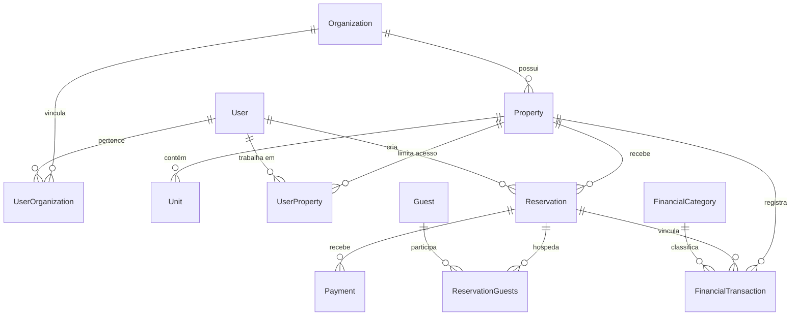

# Plano de Ação de Desenvolvimento — OCA Flow (V1)

Este documento apresenta a proposta do plano de ação de desenvolvimento para a primeira versão (V1/MVP) do **OCA Flow**, um SaaS multi-tenant de gestão hoteleira. O objetivo principal da V1 é entregar um módulo de gestão utilizável (check-in, check-out, quartos) integrado com um módulo financeiro básico (entradas, saídas, valores), garantindo flexibilidade arquitetônica para futuras implementações.

---

## Estrutura Multi-Tenant & Hierarquia

Para apoiar a regra de que uma empresa pode possuir vários hotéis e um hotel ter múltiplos funcionários com regras específicas, a modelagem de dados proposta no Prisma segue a seguinte hierarquia:



1. **Organization (Empresa)**: Entidade raiz (inquilino/tenant). Toda a cobrança e governança geral é associada a ela.
2. **Property (Hotel/Propriedade)**: Cada empresa pode ter várias propriedades físicas (hotéis, pousadas, casas de temporada).
3. **User (Usuário/Funcionário)**: Possui duas tabelas de amarração para controle de acessos:
   - `UserOrganization` define a função (`ADMIN`, `MANAGER`, `STAFF`) dentro da empresa global.
   - `UserProperty` restringe a qual(is) hotel(is) específico(s) aquele funcionário possui acesso no dia a dia.

---

## Decisões de Negócio & Regras Definidas (V1)

> [!IMPORTANT]
> **1. Gestão de Tarifas e Valores (`Unit`)**
> Os quartos (`Unit`) terão uma diária padrão configurada (`defaultDailyPrice`). No entanto, este valor servirá apenas como base (sugestão). No ato da criação ou edição de uma reserva, o operador poderá alterar livremente o valor da diária ou o valor total da reserva.
>
> **2. Integração de Pagamento**
> Na **V1 (MVP)**, a gestão de pagamentos será **totalmente manual** (o operador registra PIX, Cartão, Dinheiro manualmente). Integração direta com gateways (ex: Asaas, Mercado Pago) será implementada na **V2**.
>
> **3. Bloqueio de Overbooking & Horários Customizados**
> O sistema bloqueará de forma **rígida** qualquer sobreposição de reservas para o mesmo quarto. Cada hotel (`Property`) terá horários padrão de check-in e check-out configuráveis em seu cadastro, que serão levados em consideração pelo algoritmo de validação de disponibilidade.

---

## Decisões Técnicas Pendentes (Revisão Necessária)

> [!WARNING]
> **Políticas de Isolamento (Segurança Multi-Tenant)**
> Devemos decidir se a validação do contexto da empresa e hotel será tratada implicitamente em cada repositório/serviço ou se usaremos um middleware/guard do NestJS que injeta e valida o `organizationId` e `propertyId` de forma global nas requisições. O isolamento lógico de banco de dados rígido é essencial antes de colocar em produção.

> [!TIP]
> **Fluxo de Caixa Automatizado**
> Propomos que toda reserva ao mudar de status para confirmada ou ao receber pagamentos (`Payment`) crie automaticamente um lançamento no módulo financeiro (`FinancialTransaction`). Isso evita que o operador precise lançar a mesma entrada manualmente.

---

## Alterações Propostas por Componente

As alterações propostas focam em ajustar o banco de dados, finalizar os módulos do back-end e criar as interfaces do usuário no Next.js (que atualmente está vazio).

### 1. Back-end (`apps/api`)

Refatorar os módulos existentes e o banco de dados para garantir as regras de negócio:

#### [MODIFY] [schema.prisma](file:///c:/Users/Go4Digital/Documents/gustavo.documents/Oca/apps/api/prisma/schema.prisma)
- **Model `Property`**: Adicionar `defaultCheckinTime String @default("14:00")` e `defaultCheckoutTime String @default("12:00")` para parametrizar os horários de check-in/out de cada hotel.
- **Model `Unit`**: Adicionar `defaultDailyPrice Float @default(0)` para sugerir o preço padrão na criação da reserva.

#### [MODIFY] [reservation.service.ts](file:///c:/Users/Go4Digital/Documents/gustavo.documents/Oca/apps/api/src/modules/reservation/reservation.service.ts)
- Adicionar validação de datas (garantir que `checkout > checkin`).
- Implementar verificação de disponibilidade do quarto (`Unit`) considerando os horários de check-in/out da propriedade para evitar choque de reservas (bloqueio rígido de sobreposição).
- Implementar a transição de status (Check-in e Check-out):
  - **Check-in**: Atualizar status da reserva para ativo/confirmado e registrar o horário real.
  - **Check-out**: Validar pagamentos pendentes, fechar a conta da reserva e criar a transação financeira de receita correspondente.

#### [MODIFY] [financial-transaction.service.ts](file:///c:/Users/Go4Digital/Documents/gustavo.documents/Oca/apps/api/src/modules/financial/services/financial-transaction.service.ts)
- Adicionar lógica para buscar relatórios simples (DRE básico: Receitas vs Despesas do período).
- Impedir exclusão de transações que estejam vinculadas a pagamentos ou reservas ativas sem a devida reversão.

#### [NEW] [tenant.guard.ts](file:///c:/Users/Go4Digital/Documents/gustavo.documents/Oca/apps/api/src/guards/tenant.guard.ts)
- Guard global ou específico de rota que valida se o `User` autenticado realmente pertence à `Organization` informada nos parâmetros de consulta (`propertyId` ou `organizationId`).

---

### 2. Front-end (`apps/web`)

Criar a interface hoteleira moderna, utilizando o Next.js 15 (App Router).

#### [NEW] [Dashboard (Visão Geral)](file:///c:/Users/Go4Digital/Documents/gustavo.documents/Oca/apps/web/src/app/(dashboard)/page.tsx)
- Painel principal exibindo as seguintes métricas rápidas:
  - Quartos Ocupados / Quartos Disponíveis.
  - Check-ins previstos para hoje / Check-outs previstos.
  - Resumo financeiro rápido do dia (Entradas vs Saídas).

#### [NEW] [Grade de Reservas (Calendário)](file:///c:/Users/Go4Digital/Documents/gustavo.documents/Oca/apps/web/src/app/(dashboard)/reservations/page.tsx)
- Visualização em grade hoteleira (Gantt-style/Timeline) exibindo os quartos no eixo Y e os dias do mês no eixo X.
- Possibilidade de clicar em um espaço vazio para iniciar uma reserva ou clicar em uma reserva existente para abrir o modal de detalhes (com botões de Check-in, Check-out e Lançar Pagamento).

#### [NEW] [Módulo Financeiro (Fluxo de Caixa)](file:///c:/Users/Go4Digital/Documents/gustavo.documents/Oca/apps/web/src/app/(dashboard)/financial/page.tsx)
- Tela exibindo a lista de transações (receitas/despesas) filtradas por período e propriedade.
- Gráfico simples de fluxo de caixa (Entradas vs Saídas).
- Modais para lançar transações manuais (ex: despesa com lavanderia, compra de suprimentos).

#### [NEW] [Gestão de Quartos e Hóspedes](file:///c:/Users/Go4Digital/Documents/gustavo.documents/Oca/apps/web/src/app/(dashboard)/settings/page.tsx)
- Tela para cadastro e edição de quartos (`Unit`), capacidades, descrições e status de limpeza/manutenção.
- Cadastro rápido de Hóspedes (`Guest`) com validação de CPF.

---

## Cronograma de Execução (Fases)

### Fase 1: Segurança, Autenticação & Multi-Tenant (Semana 1)
- [ ] Implementar o `TenantGuard` no back-end para filtrar todas as rotas com base no `organizationId` ou `propertyId` do usuário logado.
- [ ] Criar a tela de Login no Next.js (`apps/web`) integrada ao backend (Auth via Cookies HttpOnly, conforme o `passo-a-passo.md`).
- [ ] Implementar Contexto Global do Usuário no Front-end (armazena a organização selecionada e o hotel atual que o funcionário está operando).

### Fase 2: Gestão Operacional e Quarto (Semana 2)
- [ ] **Back-end**: Validar disponibilidade e evitar reservas duplicadas no mesmo quarto.
- [ ] **Front-end**: Desenvolver a listagem de quartos e tela de cadastro de hóspedes.
- [ ] **Front-end**: Desenvolver o Mapa de Ocupação/Calendário das reservas.
- [ ] **Operação**: Criar fluxo visual para realizar Check-in (mudar status para `CONFIRMED` e associar hóspedes) e Check-out (mudar status e conferir pagamentos).

### Fase 3: Financeiro Básico e Lançamentos (Semana 3)
- [ ] **Back-end**: Criar gatilhos para que cada checkout de reserva com pagamento confirmado crie automaticamente um registro de receita (`INCOME`) no fluxo de caixa.
- [ ] **Back-end**: Criar endpoint de consolidado financeiro (entradas totais, saídas totais, saldo por hotel no mês).
- [ ] **Front-end**: Criar a tela de fluxo de caixa com lançamento manual de despesas (ex: luz, faxina, manutenção) e receitas extras (consumo de frigobar).

### Fase 4: Ajustes Finos e Testes Cruzados (Semana 4)
- [ ] **Homologação**: Testar exaustivamente o isolamento multi-empresa (garantir que um funcionário do Hotel A de uma empresa não consiga ver as reservas do Hotel B de outra empresa).
- [ ] **Mock de Dados**: Inserir dados fictícios de teste para demonstração para o parceiro.
- [ ] **Deploy**: Subir a primeira versão em ambiente de staging/teste (ex: Vercel para o front e Supabase/Render para o back).

---

## Plano de Verificação (Testes)

### Testes Automatizados
```bash
# Executar testes da API
pnpm --filter @oca/api test

# Verificar integridade dos tipos TypeScript em todo o monorepo
pnpm typecheck
```

### Verificação Manual (Roteiro de Validação)
1. **Verificação de Permissões**: 
   - Cadastrar dois hotéis sob a mesma organização. Logar com um usuário que tem permissão apenas no *Hotel A* (via `UserProperty`).
   - Tentar acessar a URL de listagem de reservas do *Hotel B* no front-end e via requisição direta à API. O sistema deve retornar um erro HTTP `403 Forbidden`.
2. **Ciclo de Vida da Reserva & Caixa**:
   - Criar uma reserva para o Quarto 101.
   - Efetuar o **Check-in**. O quarto deve constar como ocupado no mapa de ocupação.
   - Realizar o **Check-out** com pagamento via PIX.
   - Ir ao painel **Financeiro** e conferir se o valor diário da reserva foi devidamente lançado como receita automática na categoria correspondente.
